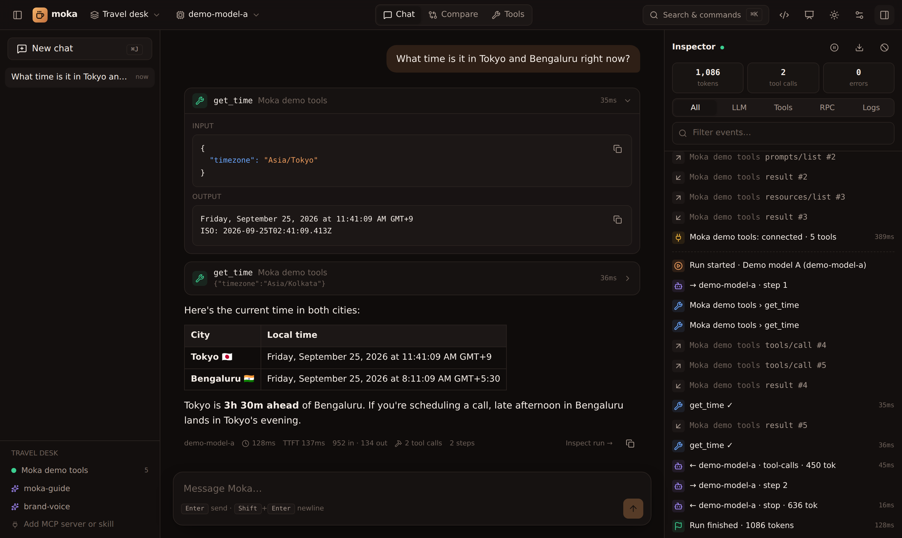
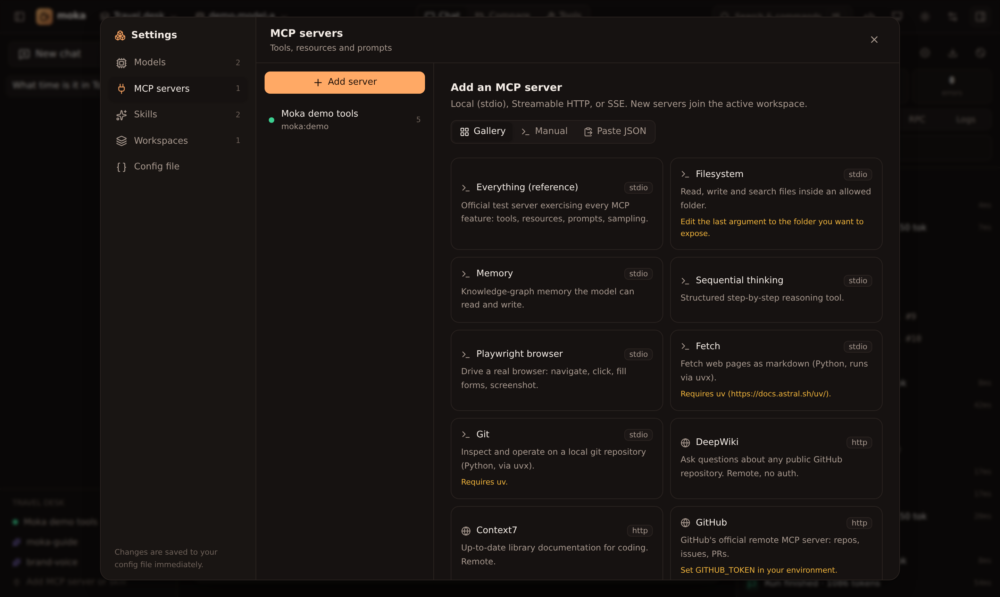
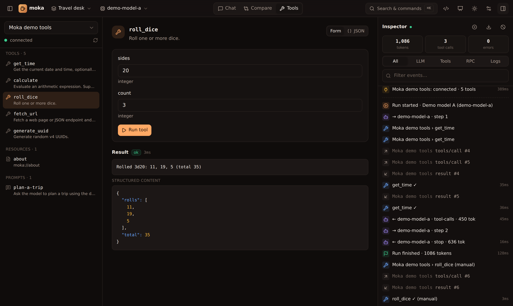
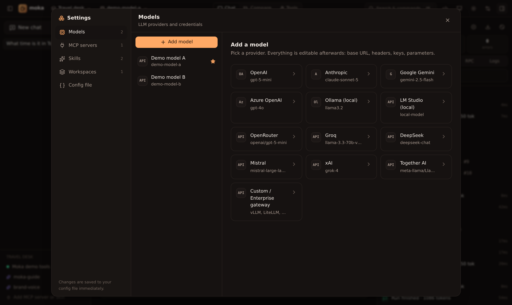

<div align="center">


# Moka

**Any LLM. Any MCP server. Any skill. One command.**

*Tiny arms. Strong brew.* ☕

A local sandbox to chat with any model, plug in MCP servers and Agent Skills, and see every call in a live inspector.

[](https://www.npmjs.com/package/@mokalabs/sandbox)
[](https://github.com/mokahq/mokalabs/actions/workflows/ci.yml)
[](LICENSE)
[](https://mokahq.github.io/mokalabs/)

```bash
npx @mokalabs/sandbox
```



</div>

---

## Why Moka

Getting an LLM talking to MCP tools usually means wiring up a client, a provider SDK, a tool loop and some logging before you can even try one prompt. Moka does all of that for you:

- **Zero config.** Moka picks up `OPENAI_API_KEY`, `ANTHROPIC_API_KEY`, `GEMINI_API_KEY`, `OPENROUTER_API_KEY`, `GROQ_API_KEY` and others from your environment, finds a local Ollama, and ships with a built-in demo MCP server, so the first run has working tools.
- **Any model.** OpenAI, Anthropic, Gemini, Azure OpenAI, Ollama, LM Studio, OpenRouter, Groq, DeepSeek, Mistral, xAI and Together are built in. Any OpenAI-compatible gateway (vLLM, LiteLLM, a corporate proxy) also works, with custom base URLs, headers and provider options.
- **Any MCP server.** stdio, Streamable HTTP and SSE. Paste your Claude Desktop, Cursor or VS Code `mcp.json`, or pick one from the gallery.
- **Agent Skills.** Point Moka at a `SKILL.md` folder (including `~/.claude/skills`). Skills load on demand, the same way Claude does it.
- **Inspector.** Every LLM step, tool call, token count and raw MCP JSON-RPC message, with timings and a per-run waterfall.
- **Forms for everything.** Models, servers, skills and workspaces are all editable in the UI. Changes are written to a readable `moka.json`.
- **Built for demos.** Workspaces, starter prompts, presenter mode, side-by-side model comparison, and a ⌘K command palette.
- **Generative UI.** Moka renders [MCP Apps](https://github.com/modelcontextprotocol/ext-apps) (the official MCP UI extension) in a secure sandbox, supports legacy MCP-UI, and lets *any* model answer with native [A2UI](https://github.com/google/A2UI) forms, cards and buttons through a built-in `render_ui` tool.
- **Export to code.** Turn any workspace into Vercel AI SDK (TypeScript) or LangGraph (Python) code, or an `mcp.json`.

## Quick start

```bash
# 1. Run it (Node 20+)
export OPENAI_API_KEY=sk-...       # optional: add keys in the UI instead
npx @mokalabs/sandbox

# 2. …or scaffold a shareable demo project
npm create moka@latest my-demo
cd my-demo && npm install && npm start

# 3. …or use Docker
docker run --rm -p 4000:4000 -e OPENAI_API_KEY ghcr.io/mokahq/moka
```

Moka prints a URL with a one-time access token and opens your browser.

| | |
|---|---|
|  |  |
| **Add MCP servers** from a gallery, a form, or pasted JSON | **Compare** models on the same prompt and tools |
|  |  |
| **Call tools directly** with generated forms, no LLM needed | **Configure any provider**: keys, base URL, headers, options |

## Using Moka

### Models
**Settings → Models → Add model** and pick a preset. Every field can be edited: model, API key, base URL, headers, temperature, max tokens and raw AI SDK `providerOptions`. Use **Fetch models** to list what your key can reach and **Test** to check it works.

API keys can be pasted directly or referenced as `env:OPENAI_API_KEY`. References are resolved at request time and never written to disk, so `moka.json` stays safe to commit.

### MCP servers
**Settings → MCP servers → Add server** gives you three options:

- **Gallery:** Everything, Filesystem, Memory, Playwright, Fetch, Git, DeepWiki, Context7, GitHub…
- **Manual:** stdio (command, args, env, cwd) or HTTP/SSE (URL, headers). `${VAR}` expands from the environment.
- **Paste JSON:** the `mcpServers` block from Claude Desktop, Claude Code, Cursor or Windsurf, or VS Code's `servers`.

Once connected, you can switch individual tools on or off for the model, and call them manually from the **Tools** view.

### Skills
A skill is a folder containing a `SKILL.md` (YAML frontmatter with `name` and `description`, then instructions) plus optional reference files. Moka lists each skill's name and description in the system prompt. The model calls the built-in `load_skill` tool when a skill is relevant, and `read_skill_file` to read the skill's other files.

**Settings → Skills** lets you add one folder, scan a folder of skills, or write a skill inline.

### Workspaces
A workspace combines **model + MCP servers + skills + system prompt + starter prompts**. Create one per demo and switch between them from the top bar.

### Inspector
The right-hand panel streams everything Moka does:

- `run.start` / `run.finish`: system prompt, tool list, total tokens
- `llm.request` / `llm.response`: per step, with provider request body, finish reason, usage and latency
- `tool.call` / `tool.result` / `tool.error`: arguments, outputs and durations
- `mcp.rpc`: raw JSON-RPC in both directions, including the `initialize` handshake
- `mcp.status` / `mcp.log`: connections and server stderr

Click any event to see its full payload and the run's waterfall. **Download trace** exports everything as JSON.

### Generative UI
Ask the demo server to *"roll 3 dice"* to get an **MCP App**: an interactive iframe that calls tools and posts messages back into the chat. Ask *"book a table at Toit"* to get **A2UI** returned by an MCP tool. Ask for *"a signup form"* and the model itself builds A2UI with `render_ui`. Button presses go back to the agent as `[ui action]` messages. Full guide: [docs → Generative UI](https://mokahq.github.io/mokalabs/generative-ui/overview/).

### Keyboard

| | |
|---|---|
| `⌘K` | Command palette |
| `⌘J` | New chat |
| `⌘B` / `⌘I` | Toggle sidebar / inspector |
| `⌘.` | Presenter mode |
| `⌘,` | Settings |
| `/` | Focus the composer |

## CLI

```text
npx @mokalabs/sandbox [config.json] [options]
moka [config.json] [options]          # after npm i -g @mokalabs/sandbox
moka init                             # write a starter moka.json here
moka demo-server                      # run the bundled demo MCP server on stdio

-p, --port <n>        port (default 4000, or $PORT; next free port if taken)
-H, --host <host>     bind address (default 127.0.0.1)
-c, --config <file>   config file (default ./moka.json, else ~/.moka/config.json)
    --token <t>       fixed access token (default: random, or $MOKA_TOKEN)
    --no-auth         disable the token (trusted machines only)
    --no-open         don't open a browser
```

**Config lookup order:** `--config`, then `$MOKA_CONFIG`, then `./moka.json`, then `~/.moka/config.json`. On first run Moka creates the file for you. Chat history lives in `~/.moka/sessions` (override with `$MOKA_HOME`).

## `moka.json`

```jsonc
{
  "$schema": "https://unpkg.com/@mokalabs/sandbox/dist/moka.schema.json",
  "version": 1,
  "activeWorkspaceId": "demo",
  "llms": [
    { "id": "gpt", "name": "OpenAI", "provider": "openai", "model": "gpt-5-mini", "apiKey": "env:OPENAI_API_KEY" },
    { "id": "gw", "name": "Company gateway", "provider": "openai-compatible", "model": "llama-3.3-70b",
      "baseURL": "https://llm.internal.example.com/v1", "headers": { "X-Team": "platform" }, "apiKey": "env:GATEWAY_KEY" }
  ],
  "mcpServers": [
    { "id": "fs", "name": "Filesystem", "transport": "stdio", "command": "npx",
      "args": ["-y", "@modelcontextprotocol/server-filesystem", "."] },
    { "id": "gh", "name": "GitHub", "transport": "http", "url": "https://api.githubcopilot.com/mcp/",
      "headers": { "Authorization": "Bearer ${GITHUB_TOKEN}" }, "disabledTools": ["delete_repository"] }
  ],
  "skills": [{ "id": "brand", "path": "./skills/brand-voice" }],
  "workspaces": [
    { "id": "demo", "name": "Demo", "llmId": "gpt", "mcpServerIds": ["fs", "gh"], "skillIds": ["brand"],
      "systemPrompt": "Be concise.", "starterPrompts": ["What's in this folder?"], "maxSteps": 12 }
  ]
}
```

Provider values: `openai`, `anthropic`, `google`, `azure`, `ollama`, `openai-compatible`. For the full field reference see [docs/configuration.md](docs/configuration.md).

## Docker

```bash
# Zero config, with keys from your shell
docker run --rm -p 4000:4000 -e OPENAI_API_KEY -e ANTHROPIC_API_KEY ghcr.io/mokahq/moka

# Use a moka.json (and skills) from the current folder; keep history in a volume
docker run --rm -p 4000:4000 -v "$PWD:/workspace" -v moka-data:/data -e MOKA_TOKEN=change-me ghcr.io/mokahq/moka
```

The image includes `npx` and `uvx`, so both Node and Python MCP servers work. It binds `0.0.0.0` inside the container. Set `MOKA_TOKEN` or read the generated token from `docker logs`.

## Embed the engine

The UI is a thin layer over `@mokalabs/core`, which you can use for tests, CLIs or your own UI:

```ts
import { MokaEngine, parseConfig } from "@mokalabs/core";

const engine = new MokaEngine({ config: parseConfig(myConfig) });
engine.bus.subscribe((e) => console.log(e.kind, e.title));

for await (const chunk of engine.chat({ messages: [{ role: "user", content: "What time is it in Tokyo?" }] })) {
  if (chunk.type === "text") process.stdout.write(chunk.text);
}
await engine.close();
```

## Security

Moka runs MCP servers, which are local processes, for you, so treat it like a terminal:

- It binds to `127.0.0.1` by default and every API call needs the random token printed at startup.
- `--no-auth` and `--host 0.0.0.0` are opt-in. Only use them on trusted networks.
- Keys referenced as `env:NAME` are never persisted. **Download (keys redacted)** strips literal secrets from exports.

See [SECURITY.md](SECURITY.md) to report a vulnerability.

## Packages

| Package | |
|---|---|
| [`@mokalabs/sandbox`](packages/sandbox) | The app: CLI (`npx @mokalabs/sandbox`, `moka`), HTTP server, web UI, demo MCP server |
| [`@mokalabs/core`](packages/core) | Headless engine: providers, MCP manager, skills, agent loop, event bus |
| [`create-moka`](packages/create-moka) | `npm create moka` project scaffolder |

## Documentation

Full docs live at **[mokahq.github.io/mokalabs](https://mokahq.github.io/mokalabs/)** (source in [`apps/docs`](apps/docs), built with Astro Starlight and deployed by the Docs workflow).

## Contributing

```bash
pnpm install
pnpm dev        # server on :4000 + Vite UI on :5173 with hot reload
pnpm test
pnpm --filter @mokalabs/docs dev   # docs site on :4321
```

See [CONTRIBUTING.md](CONTRIBUTING.md). Releases are automated with Changesets: see [docs/releasing.md](docs/releasing.md).

## License

[MIT](LICENSE)
