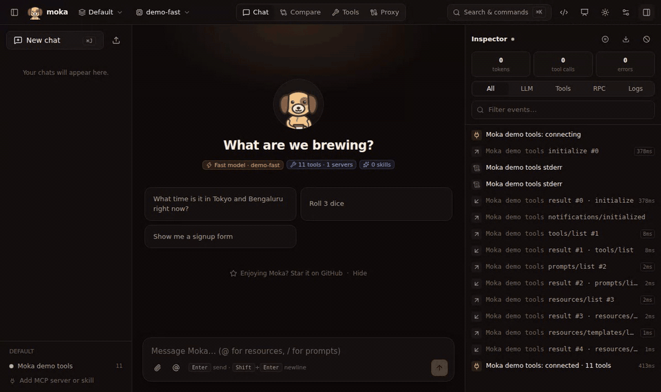
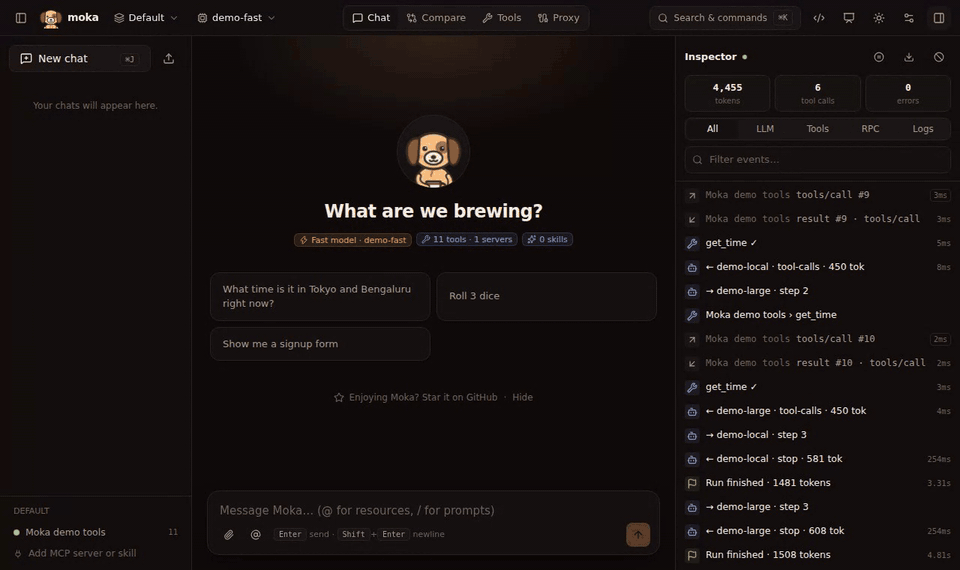
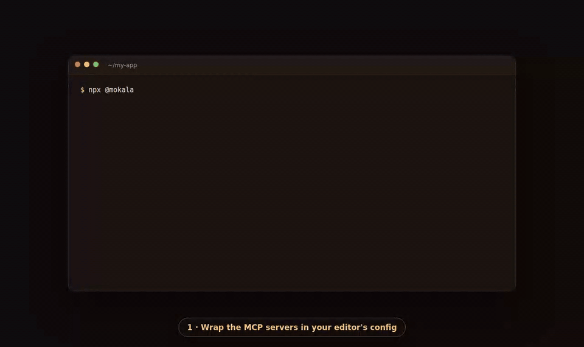
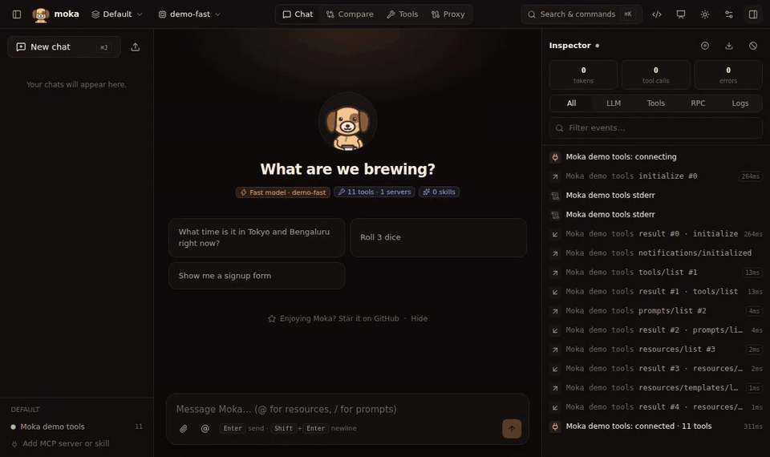
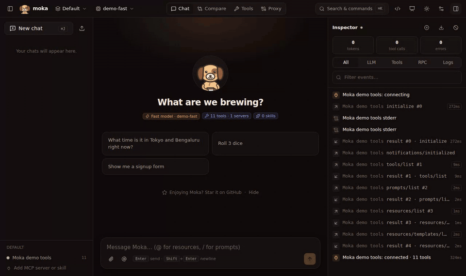

<div align="center">


# Moka

**See every MCP message.**

Chat with any LLM, plug in any MCP server, agent or skill, and inspect every call. Or put Moka in front of your AI editor and see what it sends to your servers. One command, zero config, 100% local.

[](https://www.npmjs.com/package/@mokalabs/sandbox)
[](https://github.com/mokahq/mokalabs/actions/workflows/ci.yml)
[](LICENSE)
[](https://mokalabs.dev/)

```bash
npx @mokalabs/sandbox
```

<sub>Node 20+. Picks up your API keys from the environment and ships with a demo MCP server, so the first run has working tools.</sub>

<sub>⭐ If Moka saves you time, a star helps other people find it.</sub>

</div>

---

## Compare models

Run one prompt against several models with the same MCP tools, side by side: answers, tool calls, latency and tokens.



OpenAI, Anthropic, Gemini, Azure OpenAI, Ollama, LM Studio, OpenRouter, Groq, DeepSeek, Mistral, xAI and Together are built in, plus any OpenAI-compatible gateway (vLLM, LiteLLM, a corporate proxy). [Compare guide →](https://mokalabs.dev/guides/compare/)

## Call tools directly

Pick any tool, resource or prompt from your MCP servers and run it from a form generated from its schema. No model needed. Long-running tools show live progress.



stdio, Streamable HTTP and SSE servers, with OAuth sign-in, elicitation and sampling. Add servers from a gallery or paste your Claude Desktop, Cursor or VS Code `mcp.json`. [Tool runner guide →](https://mokalabs.dev/guides/tool-runner/)

## See what your AI editor sends to your MCP servers

Put the Moka proxy in front of the MCP servers of GitHub Copilot (VS Code), Cursor, Claude Desktop, Claude Code, Windsurf or Gemini. Every message between them shows up in Moka's **Proxy** tab, live: timeouts, retries, late replies and errors.

```bash
npx @mokalabs/proxy wrap     # finds your editor configs and asks before changing anything
npx @mokalabs/sandbox        # → Proxy tab
```



Messages pass through untouched. **Export** saves everything recorded as one JSON file, with secrets redacted, ready for a bug report. `npx @mokalabs/proxy unwrap` puts your configs back. [Proxy guide →](https://mokalabs.dev/guides/proxy/)

## Chat and inspect every call

Chat with any model and your MCP servers. The inspector shows every LLM step, tool call and raw JSON-RPC message, each response paired with its request.



Retries of a tool call are grouped as attempts, with a warning when a retry may have written twice. You can also see a call's arguments as the model streamed them and as the server received them. [Inspector guide →](https://mokalabs.dev/guides/inspector/)

## Generative UI, from your own agent

Point Moka at a LangGraph, CopilotKit or ADK agent over AG-UI or A2A, and get a chat UI, generative UI and the inspector for it. Tools that answer with [A2UI](https://github.com/google/A2UI) render as real forms and cards. Button presses go back to the agent.



The agent in this clip is in [`examples/langgraph-a2ui`](examples/langgraph-a2ui). Moka also renders [MCP Apps](https://github.com/modelcontextprotocol/ext-apps), and any model can answer with A2UI through the built-in `render_ui` tool. [Generative UI guide →](https://mokalabs.dev/generative-ui/overview/)

## More

- **Agent Skills.** Point Moka at a `SKILL.md` folder (including `~/.claude/skills`). Skills load on demand, the same way Claude loads them.
- **Workspaces.** Model + MCP servers + skills + system prompt + starter prompts, one per demo. Presenter mode, tool approvals and a ⌘K palette help with live demos.
- **Replay.** Replay any saved chat offline, with no model calls.
- **Export to code.** Turn a workspace into Vercel AI SDK (TypeScript) or LangGraph (Python) code, or an `mcp.json`.
- **Works at work.** `HTTPS_PROXY`/`NO_PROXY`, custom CAs, and a zero-dependency package for curated registries.

## Quick start

```bash
npx @mokalabs/sandbox                      # run it
npm create moka@latest my-demo             # or scaffold a shareable demo project
docker run --rm -p 4000:4000 -e OPENAI_API_KEY ghcr.io/mokahq/moka   # or Docker
```

Moka prints a URL with a one-time access token and opens your browser. Add models, servers and skills in **Settings**. Everything is saved to a readable `moka.json`, and keys can stay in your environment (`"apiKey": "env:OPENAI_API_KEY"`).

```jsonc
{
  "llms": [{ "id": "gpt", "name": "OpenAI", "provider": "openai", "model": "gpt-5-mini", "apiKey": "env:OPENAI_API_KEY" }],
  "mcpServers": [{ "id": "fs", "name": "Filesystem", "transport": "stdio", "command": "npx", "args": ["-y", "@modelcontextprotocol/server-filesystem", "."] }],
  "workspaces": [{ "id": "demo", "name": "Demo", "llmId": "gpt", "mcpServerIds": ["fs"] }]
}
```

[Configuration](https://mokalabs.dev/reference/config/) · [CLI](https://mokalabs.dev/reference/cli/) · [Docker](https://mokalabs.dev/deploy/docker/) · [Embed the engine](https://mokalabs.dev/reference/core/)

## 100% local, and safe by default

Moka runs entirely on your machine. There's no Moka backend, no account and no telemetry, and Moka makes no network calls of its own: no update checks, no analytics, no CDN.

- **Your data stays with you.** Prompts go only to the model you pick (with Ollama or LM Studio, nothing leaves your machine) and tool calls only to the MCP servers you add. Chat history and proxy recordings stay in `~/.moka`.
- **Your keys stay in your environment.** Reference them as `env:OPENAI_API_KEY` and they're resolved in memory, never written to disk. Exports redact secrets.
- **Locked to you.** Moka binds to `127.0.0.1`, and every API call needs the random token printed at startup. `--host 0.0.0.0` and `--no-auth` are explicit opt-ins.
- **Sandboxed UI.** MCP Apps run in a sandboxed iframe, and A2UI is data only: no code from a server or model runs in the page.

Moka runs MCP servers (local programs) for you, so treat it like a terminal and only add servers you trust. [Security details →](https://mokalabs.dev/deploy/security/) · [Report a vulnerability](SECURITY.md)

## Packages

| Package | |
|---|---|
| [`@mokalabs/sandbox`](packages/sandbox) | The app: CLI (`npx @mokalabs/sandbox`, `moka`), server, web UI, demo MCP server |
| [`@mokalabs/proxy`](packages/proxy) | Pass-through proxy for your editor's MCP servers, and `wrap` / `unwrap` for their configs |
| [`@mokalabs/core`](packages/core) | Headless engine: providers, MCP client, skills, agent loop, event bus |
| [`create-moka`](packages/create-moka) | `npm create moka` project scaffolder |

## Contributing

```bash
pnpm install
pnpm dev        # server on :4000 + Vite UI on :5173 with hot reload
pnpm test
```

Full docs at **[mokalabs.dev](https://mokalabs.dev/)** (source in [`apps/docs`](apps/docs)). See [CONTRIBUTING.md](CONTRIBUTING.md) and [docs/releasing.md](docs/releasing.md).

## License

[MIT](LICENSE)
