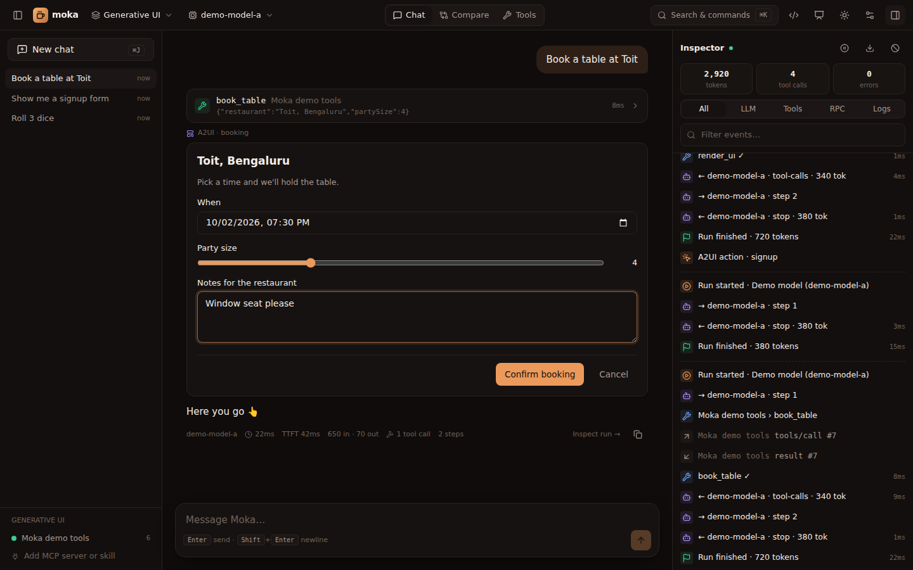

import { Tabs, TabItem, Aside, Steps } from "@astrojs/starlight/components";



[A2UI](https://github.com/google/A2UI) ("Agent to UI") is an open protocol where the agent describes UI as **JSON data** — a flat list of components plus a data model — and the client renders it with native components. No code crosses the boundary, so it's safe to render UI straight from a model.

Moka implements **A2UI v0.9** (and reads v0.8 messages), with the standard component catalog.

## Two ways to get A2UI in Moka

<Tabs>
<TabItem label="From any model: render_ui">
Every workspace gives the model a built-in **`render_ui`** tool. Its description teaches the model the component catalog, so it works with any tool-calling model: GPT, Claude, Gemini, Llama. You can rename it, restrict or extend its components, and theme it; see [Customize the render tool](/generative-ui/customize/) and [Custom catalogs](/generative-ui/catalogs/).

```json title="render_ui input (what the model sends)"
{
  "surfaceId": "signup",
  "components": [
    { "id": "root", "component": "Card", "child": "col" },
    { "id": "col", "component": "Column", "children": ["title", "name", "plan", "go"] },
    { "id": "title", "component": "Text", "text": "Join the beta", "variant": "h3" },
    { "id": "name", "component": "TextField", "label": "Your name", "value": { "path": "/name" } },
    { "id": "plan", "component": "ChoicePicker", "label": "Plan", "value": { "path": "/plan" },
      "options": [{ "label": "Free", "value": "free" }, { "label": "Pro", "value": "pro" }] },
    { "id": "go-label", "component": "Text", "text": "Sign me up" },
    { "id": "go", "component": "Button", "variant": "primary", "child": "go-label",
      "action": { "event": { "name": "signup", "context": { "name": { "path": "/name" }, "plan": { "path": "/plan" } } } } }
  ],
  "data": { "name": "", "plan": "pro" }
}
```

Moka validates the tree against the active catalogs (a `root` component must exist, every reference must resolve, components and required props must exist). If it's invalid, the model gets a precise error and usually [fixes it on the next step](/generative-ui/customize/#self-repair).
</TabItem>
<TabItem label="From an MCP server">
Return A2UI messages from any tool as an embedded resource with mime type `application/json+a2ui`:

```js
server.registerTool("book_table", { inputSchema: { restaurant: z.string() } }, async ({ restaurant }) => ({
  content: [
    { type: "text", text: `Showing a booking form for ${restaurant}.` },
    {
      type: "resource",
      resource: {
        uri: "a2ui://my-server/booking",
        mimeType: "application/json+a2ui",
        text: JSON.stringify([
          { version: "v0.9", createSurface: { surfaceId: "booking", catalogId: "https://a2ui.org/specification/v0_9/standard_catalog.json" } },
          { version: "v0.9", updateComponents: { surfaceId: "booking", components: [ /* … */ ] } },
          { version: "v0.9", updateDataModel: { surfaceId: "booking", path: "/", value: { restaurant } } },
        ]),
      },
    },
  ],
}));
```

Moka also accepts `structuredContent: { a2ui: [...messages] }`. The UI payload is replaced with a short placeholder in the model's context, so it doesn't waste tokens.
</TabItem>
</Tabs>

## Messages

| Message | Purpose |
|---|---|
| `createSurface` | Start a surface (`surfaceId`, `catalogId`) |
| `updateComponents` | Add or replace components on a surface (flat list, referenced by id) |
| `updateDataModel` | Set data at a JSON Pointer `path` (default `/`) |
| `deleteSurface` | Remove a surface |

Exactly one component per surface must have `"id": "root"`. v0.8 messages (`surfaceUpdate`, `dataModelUpdate`, `beginRendering`, `{"Text": {...}}` wrappers) are converted automatically.

## Data binding

Any property can be a literal or a **path** into the surface's data model:

```json
{ "id": "greeting", "component": "Text", "text": { "path": "/user/name" } }
```

Input components (`TextField`, `CheckBox`, `Slider`, `ChoicePicker`, `DateTimeInput`) bind **two-way**: the user edits the data model directly.

Lists can repeat a template for every item of an array:

```json
{ "id": "list", "component": "List", "children": { "componentId": "row", "path": "/items" } },
{ "id": "row", "component": "Text", "text": { "path": "name" } }
```

Inside a template, relative paths (`"name"`) resolve against the current item.

## Actions: how the agent hears back

When the user presses a **Button**, Moka resolves the action's `context` against the data model and sends the agent a user message:

```text
[ui action] {"name":"signup","surfaceId":"signup","sourceComponentId":"go","timestamp":"2026-09-25T10:12:00.000Z","context":{"name":"Batman","plan":"pro"}}
```

The chat shows a compact chip (*▸ signup*) instead of the raw JSON, the button is marked as sent, and the agent continues — for example by calling a booking tool with those values.

<Aside type="tip">Tell the model what to do with actions in your system prompt: *"When you receive a `[ui action]` for `confirm_booking`, call the `create_booking` tool with its context."*</Aside>

See every supported component in the [component catalog](/generative-ui/a2ui-components/).
