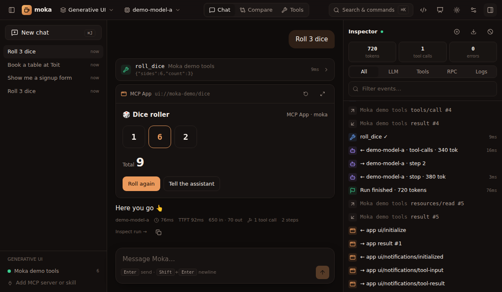

import { Card, CardGrid, Aside } from "@astrojs/starlight/components";

Text is a poor interface for many tasks: picking a time, filling a form, comparing options, exploring a chart. Moka supports the two open standards that let agents show **real UI** in the chat.

<CardGrid>
  <Card title="MCP Apps" icon="seti:html">
    **Server-authored HTML apps.** An MCP server ships a `ui://` resource; Moka renders it in a sandboxed iframe and connects it to the conversation over JSON-RPC. Rich, custom, fully interactive.

    [MCP Apps →](/generative-ui/mcp-apps/)
  </Card>
  <Card title="A2UI" icon="list-format">
    **Declarative, native UI.** The agent sends JSON describing components (cards, forms, buttons…) and Moka renders them with its own design system. Safe by construction, works with any model.

    [A2UI →](/generative-ui/a2ui/)
  </Card>
</CardGrid>

## Which one should I use?

| | MCP Apps | A2UI |
|---|---|---|
| **Authored by** | The MCP server developer (HTML/JS) | The model or the server (JSON) |
| **Rendering** | Sandboxed iframe | Native components in Moka's design system |
| **Flexibility** | Anything a web page can do | Standard component catalog |
| **Security model** | Isolated origin + CSP; app can only talk via postMessage | No code runs — data only |
| **Best for** | Dashboards, maps, editors, rich visualisations | Forms, confirmations, choices, cards, generated on the fly |
| **Talks back via** | `tools/call`, `ui/message`, … | Button actions → `[ui action]` message to the agent |

## Try both in 30 seconds

Start Moka with the built-in demo server and ask:

- **"Roll 3 dice"** → `roll_dice` returns an **MCP App**: an interactive dice roller whose *Roll again* button calls the tool itself, and *Tell the assistant* posts a message into the chat.
- **"Book a table at Toit for 4"** → `book_table` returns **A2UI** from an MCP server: a booking form with date/time, party size and notes.
- **"Show me a signup form"** → the model itself generates **A2UI** with the built-in `render_ui` tool.

<Aside type="tip">Everything the UIs send and receive is visible in the inspector under **Tools** (`ui.rpc` and `ui.action` events).</Aside>

## Legacy MCP-UI

Servers built with the earlier [MCP-UI](https://mcpui.dev) convention — tool results that embed a `resource` with a `ui://` URI and `text/html` or `text/uri-list` content — also render, and their `tool`, `prompt`, `link`, `intent` and `notify` messages are supported.
