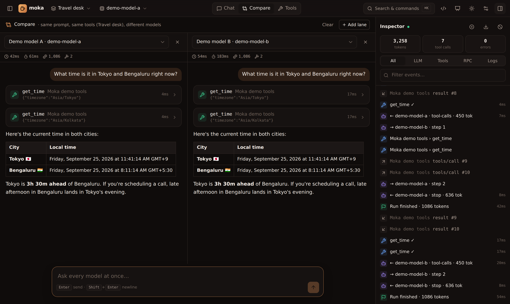

**Compare** (top bar) sends every prompt to 2–4 **lanes** at once. Each lane uses a different model but the **same workspace**: same MCP servers, skills and system prompt — so the comparison is fair.

Per lane you get:

- ⏱ total time and time-to-first-token
- 🪙 tokens used
- 🔨 number of tool calls
- the full conversation, including tool calls and generative UI

Lanes keep their own history, so follow-up questions work. Change a lane's model to reset it; **Clear** resets all lanes. Every run also appears in the inspector.

Typical uses: choosing a model for a use case, checking a cheaper model still calls tools correctly, or demoing the difference between a local and a frontier model.
