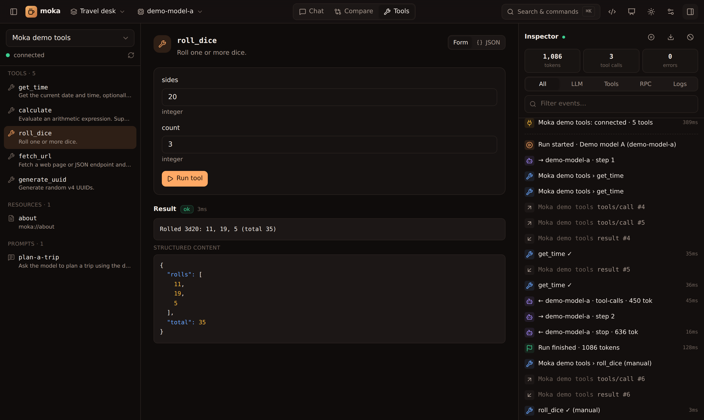

The **Tools** view is a manual MCP client:

- **Tools** — Moka generates a form from each tool's JSON Schema (text, numbers, booleans, enums; JSON for objects and arrays). Switch to **JSON** to edit raw arguments. **Run tool** shows text, images, structured content and errors, with timing. Tools with an MCP App render their UI here too.
- **Resources** — click to read a resource and see its contents. If the server supports subscriptions, **Watch** subscribes (`resources/subscribe`): every `notifications/resources/updated` re-reads the resource and highlights the change. Watched resources get an 👁 in the list, and subscriptions survive reconnects until you unwatch.
- **Resource templates** — parameterised resources such as `file:///{+path}` (`resources/templates/list`). Fill in the variables, check the expanded URI, then **Read resource**, or **Open (and watch)** it. RFC 6570 expressions (`{x}`, `{+x}`, `{/x}`, `{?a,b}`, …) are supported.
- **Prompts** — fill in arguments, click **Get prompt**, and **Send to chat** to use the result as a message.

Tool annotations (`readOnly`, `destructive`, `openWorld`, …) are shown as badges. Manual calls are logged in the inspector as `(manual)`.

Moka also follows `notifications/tools/list_changed`, `prompts/list_changed` and `resources/list_changed`, so lists refresh without reconnecting. Try it with the demo server's **Live brew status** resource, which changes every 3 seconds, and the **Coffee drinks** template.

This is the fastest loop when you're developing an MCP server: edit, reconnect (↻ next to the server), run.
